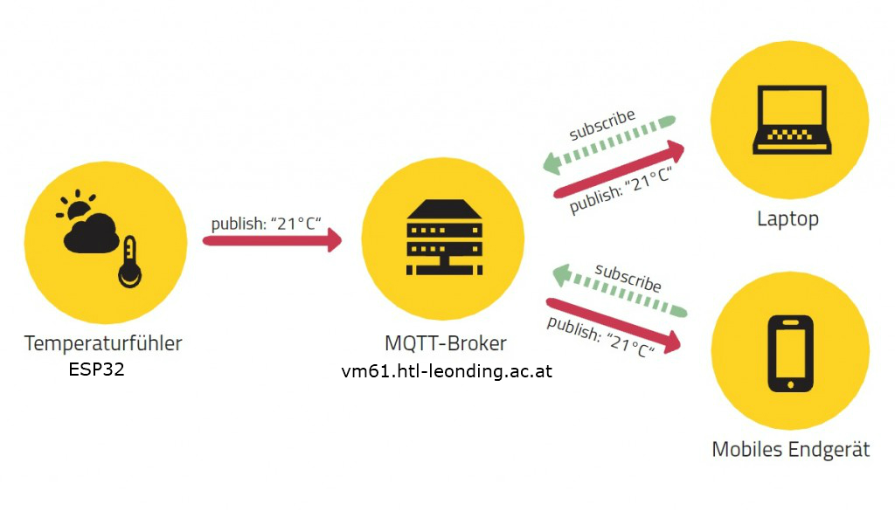
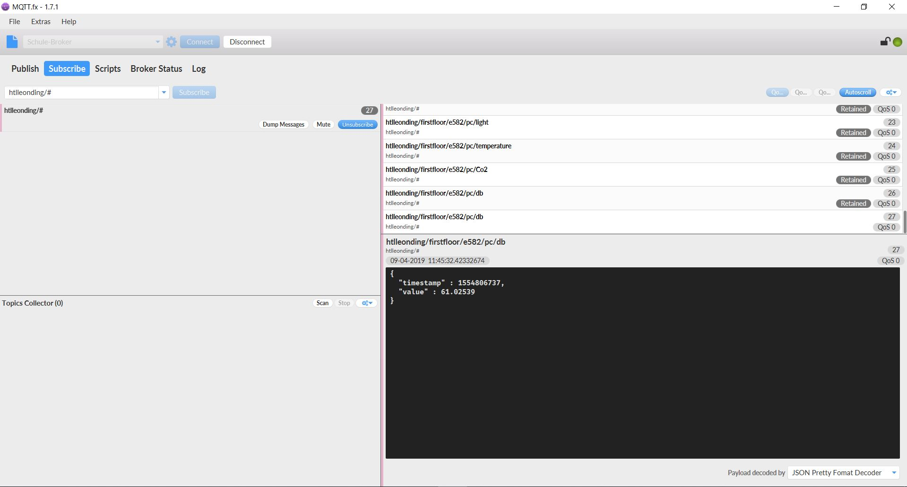

## MQTT-Schnittstellenbeschreibung

**Was ist MQTT überhaupt?**
 - MQTT = **M**essage **Q**ueuing **T**elemetry **T**ransport
 - ist ein Nachrichtenprotokoll für M2M
 - Publish-Subscribe-Kommunikation
für mehr Informationen klicken Sie [hier](https://blog.doubleslash.de/mqtt-fuer-dummies/)

## Wie ist MQTT in der HTL Leonding implementiert?

## Zugangsdaten
**URL vom MQTT-Broker**: vm61.htl-leonding.ac.at   
**Port**: 1883   
**Username**: 4bhif   
**Passwort**: für Passwort bitte E-Mail an: tripicnenad@hotmail.com

**Empfohlenes Tool**: [MQTT.fx](https://mqttfx.jensd.de/index.php/download)

## MQTT.fx - Tutorial

**Connection Profile Einstellungen**: 

> Broker Profil Einstellungen

> Zugangsdaten eingeben

**Subscribe Beispiel**

> So kann man ein Topic subscriben

## **Beispiele für Werte die man auslesen kann**

Um **alle topics** zu sehen:

    htlleonding/#

Um die aktuelle **Außentemperatur** zu bekommen:

    htlleonding/outdoor/weather/actual/temperature

Um die aktuelle **Luftfeuchtigkeit** (draußen) zu bekommen:

    htlleonding/outdoor/weather/actual/humidity
Um den aktuellen **Luftdruck** zu bekommen:

    htlleonding/outdoor/weather/actual/pressure

## Daten von einem Stockwerk
Um alle topics vom **ersten Stock (firstfloor)** zu sehen:

    htlleonding/firstfloor/#

Um die **Temperatur** zu bekommen:

    htlleonding/firstfloor/e582/pc/temperature

Um die **Luftfeuchtigkeit** zu bekommen:

    htlleonding/firstfloor/e582/pc/humidity

Um den **CO2-Gehalt** zu bekommen:

    htlleonding/firstfloor/e582/pc/Co2

Um die **Lautstärke** zu bekommen:

    htlleonding/firstfloor/e582/pc/db
