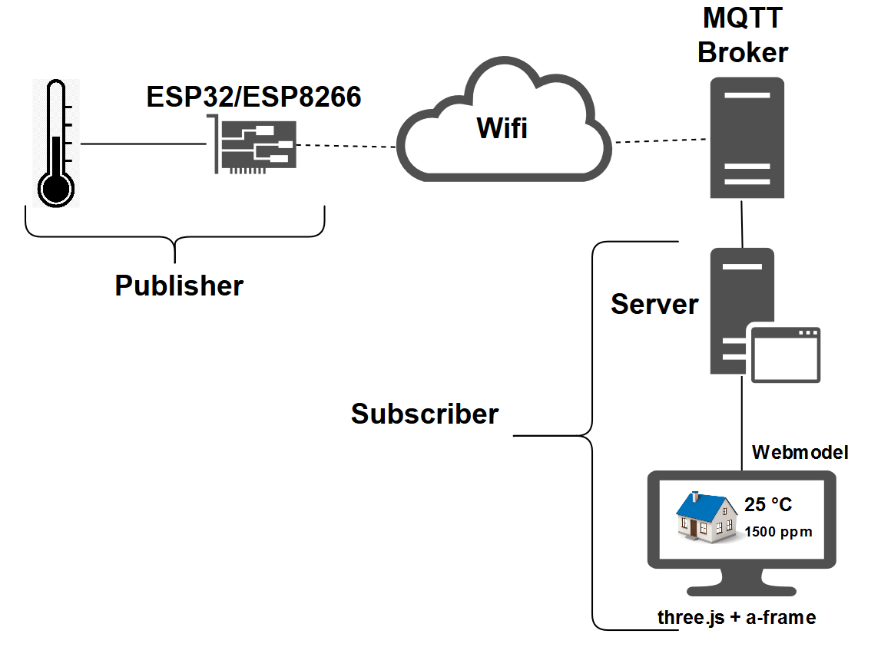
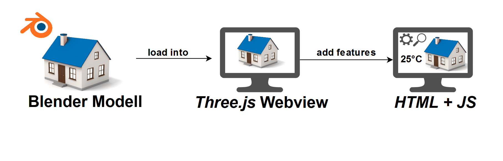

# README - Hausautomations Visualisierung :pushpin:

## :clipboard: Table of Contents
- [Introduction](#arrow_forward-introduction)
- [Architektur](#paperclip-architektur)
- [Plakat](#mag_right-projekt-plakat)
- [Software](#Software)
- [Quickstart](#rocket-quickstart)
- [Change-Log](#floppy_disk-change-log)
- [Documentation](#page_facing_up-documentation)
- [Testing](#microscope-testing)
- [Contributing](#chart_with_upwards_trend-contributing)
- [Build with](#wrench-build-with)
- [License](#lock-license)

## :arrow_forward: Introduction

 ha_visualisation (House-Automation-Visualisation) is a project to improve the overview and accessability by showing the right    information on the right position.  
 
 Developed with three.js and a-frame.
 
 This Prototype (v0.1) **isn't** a final version 
 
## :mag_right: Projekt-Plakat

## :paperclip: Architektur

## Software

## :rocket: Quickstart: 

### [three.js](https://threejs.org/)  
  is a Javascript 3D library.
  [Download](https://github.com/mrdoob/three.js/) the needed .js files here.
  
  #### Basic Code Explanation:
  
  * What do we need?
  
        <!DOCTYPE html>
           <html>
	             <head>
                 <meta charset=utf-8>
		               <title>My first three.js app</title>
		               
	             </head>
	             <body>
		               
		               
	             </body>
          </html>
          
  * Important Things
  
        var scene = new THREE.Scene();
        var camera = new THREE.PerspectiveCamera(50, window.innerWidth / window.innerHeight, 0.1, 300);
        var renderer = new THREE.WebGLRenderer();
        var controls = new THREE.OrbitControls(camera, renderer.domElement);
        
        var amlight = new THREE.AmbientLight(0xffffff, 1);
        (A light)
        
  * Structures
    
        var geometry = new THREE.BoxGeometry( 1, 1, 1 );
        var material = new THREE.MeshBasicMaterial( {color: 0x00ff00} );
        var cube = new THREE.Mesh( geometry, material );
        scene.add( cube );
A cube, spheres, circles, rectangles, donuts and much more. 
        
  * Clicking objects?
  
        var raycaster = new THREE.Raycaster();
        var YOUR_CLICKABLE_OBJECTS = [];
        //Add some objects
        
        document.addEventListener('mousedown', onDocumentMouseDown, false);
           function onDocumentMouseDown(event) {
              event.preventDefault();
              var mouseVector = new THREE.Vector3((event.clientX / window.innerWidth) * 2 - 1, 
              -(event.clientY / window.innerHeight) * 2 + 1, 0.5);

              raycaster.setFromCamera(mouseVector, camera);
              var intersects = raycaster.intersectObjects(YOUR_CLICKABLE_OBJECTS);
              if (intersects.length > 0) {
                 //Do something with the objects.
              }
        }
        
More information in our code, and the three.js Documentation.
Refering to our Code in three.js-Prototyp.

### [aframe](https://aframe.io/)
  
  - A-Frame is a web framework for building virtual reality (VR) experiences
  - A-Frame was developed to be an easy but powerful way to develop VR content
  - A-Frame is based on top of HTML, making it simple to get started. But A-Frame is not just a 3D scene graph or a markup language
  - the core is a powerful entity-component framework that provides a declarative, extensible and composable structure to three.js.
  - A-Frame supports most VR headsets and can even be used for augmented reality
  
### [Blender](https://www.blender.org/)  

  - Zum Modellieren des Modells das wir dann über Three.js in den Browser einbinden möchten benützen wir Blender. 
  - Allgemeine Infos zum modellieren von Gebäuden haben wir uns hier geholt: https://www.youtube.com/watch?v=AeRQvoTwmfA
  - Wir haben viele verschiedene Tutorials abgearbeitet und unterschiedliche Loader für Blender/JS getestet. 

## :floppy_disk: Change-Log:

Coming soon...

##  :page_facing_up: Documentation:

Project Documents:
- [Documents](Documents)

## :microscope: Testing:
Browser: FireFox Quantum 60.0.2

Known Issues:
  - Placement of objects (three.js, a lot of work)

## :chart_with_upwards_trend: Contributing:

### Developers:
- Philipp Auinger
- Nenad Tripic

School: HTL Leonding

#### To see the contributions to master, of each developer, check out [this graph.](https://github.com/philippAuinger/ha_visualisierung/graphs/contributors)

## :wrench: Build with:

- [three.js](https://threejs.org/)  
- [aframe](https://aframe.io/)
- [StackOverflow](https://stackoverflow.com)
- HTML5
- CSS
- JavaScript

## :lock: License:

[MIT License](LICENSE)

Copyright (c) 2018 Philipp A.

Permission is hereby granted, free of charge, to any person obtaining a copy
of this software and associated documentation files (the "Software"), to deal
in the Software without restriction, including without limitation the rights
to use, copy, modify, merge, publish, distribute, sublicense, and/or sell
copies of the Software, and to permit persons to whom the Software is
furnished to do so, subject to the following conditions:

The above copyright notice and this permission notice shall be included in all
copies or substantial portions of the Software.

THE SOFTWARE IS PROVIDED "AS IS", WITHOUT WARRANTY OF ANY KIND, EXPRESS OR
IMPLIED, INCLUDING BUT NOT LIMITED TO THE WARRANTIES OF MERCHANTABILITY,
FITNESS FOR A PARTICULAR PURPOSE AND NONINFRINGEMENT. IN NO EVENT SHALL THE
AUTHORS OR COPYRIGHT HOLDERS BE LIABLE FOR ANY CLAIM, DAMAGES OR OTHER
LIABILITY, WHETHER IN AN ACTION OF CONTRACT, TORT OR OTHERWISE, ARISING FROM,
OUT OF OR IN CONNECTION WITH THE SOFTWARE OR THE USE OR OTHER DEALINGS IN THE
SOFTWARE.
