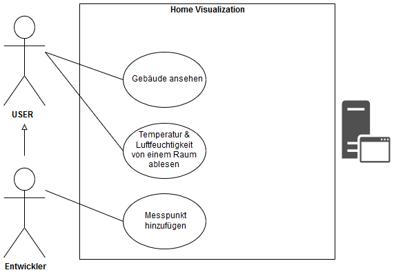

# README - Hausautomations Visualisierung :pushpin:

## :clipboard: Inhaltsverzeichnis
 - [Einleitung](#arrow_forward-Einleitung)
 - [Protokoll](#clipboard-Protokoll)
 - [Demo](#computer-Demo)
 - [Plakat](#mag_right-projekt-plakat)
 - [Architektur](#paperclip-architektur)
 - [Software](#Software)
 - [Projektstrukturplan](#Projektstrukturplan)
 - [Use-case-Diagramm](#Use-case-Diagramm)
 - [Quickstart](#rocket-quickstart) 
	 - [three.js](#threejs)
	 - [aframe](#aframe)
	 - [Blender](#blender)
 - [Change-Log](#floppy_disk-change-log)
 - [Dokumentation](#page_facing_up-dokumentation)
 - [Testing](#microscope-testing)
 - [Mitwirkende](#chart_with_upwards_trend-Mitwirkende)
 - [Werkzeug](#wrench-Werkzeug)
 - [License](#lock-license)

## :arrow_forward: Einleitung  
Unser Projekt stellt Informationen wie Temperatur, Luftfeuchtigkeit etc. von einem Raum in einem übersichtlichen 3D-Modell dar.
 Entwickelt mit three.js und a-frame.
 
## :computer: Demo

 
## :clipboard: Protokoll
[Protokoll Dokument](Documents/Protokoll.md)
 
## :mag_right: Projekt-Plakat

## :paperclip: Architektur

## Software

## Use-case-Diagramm
Als User will ich mir ein 3D-Modell der Schule ansehen können und die Temperatur samt Luftfeuchtigkeit von einem bestimmten Raum herausfinden.

## :rocket: Quickstart: 

### [three.js](https://threejs.org/)  
  ist eine Javascript 3D library.
  [Download](https://github.com/mrdoob/three.js/) die benötigten .js files hier.
  
  ### Ein einfaches Beispiel:
  
  * Was brauchen wir?
  
        <!DOCTYPE html>
           <html>
	             <head>
                 <meta charset=utf-8>
		               <title>My first three.js app</title>
		               
	             </head>
	             <body>
		               
		               
	             </body>
          </html>
          
  * Wichtige Dinge
  
        var scene = new THREE.Scene();
        var camera = new THREE.PerspectiveCamera(50, window.innerWidth / window.innerHeight, 0.1, 300);
        var renderer = new THREE.WebGLRenderer();
        var controls = new THREE.OrbitControls(camera, renderer.domElement);
        
        var amlight = new THREE.AmbientLight(0xffffff, 1);
        (A light)
	
  * Objekte laden
  	
        var loader = new THREE.GLTFLoader();
        loader.load('SchoolEntranceFenster.glb', function (gltf) {
        model = gltf.scene;
        model.position.x = 0;
        model.position.y = 0;
        model.position.z = 0;
        scene.add(gltf.scene);

    	}, undefined, function (error) {
      		console.error(error);
    	});
        
  * Strukturen
    
        var geometry = new THREE.BoxGeometry( 1, 1, 1 );
        var material = new THREE.MeshBasicMaterial( {color: 0x00ff00} );
        var cube = new THREE.Mesh( geometry, material );
        scene.add( cube );
Ein Würfel, Kugel, Kreise, Dreiecke, Donuts und vieles mehr. 
        
  * Klickbare Objekte?
  
        var raycaster = new THREE.Raycaster();
        var YOUR_CLICKABLE_OBJECTS = [];
        //Add some objects
        
        document.addEventListener('mousedown', onDocumentMouseDown, false);
           function onDocumentMouseDown(event) {
              event.preventDefault();
              var mouseVector = new THREE.Vector3((event.clientX / window.innerWidth) * 2 - 1, 
              -(event.clientY / window.innerHeight) * 2 + 1, 0.5);

              raycaster.setFromCamera(mouseVector, camera);
              var intersects = raycaster.intersectObjects(YOUR_CLICKABLE_OBJECTS);
              if (intersects.length > 0) {
                 //Do something with the objects.
              }
        }
        
Mehr Informationen sind in unserem Code und in der three.js Dokumentation.

### [aframe](https://aframe.io/)
  
  - A-Frame ist ein **web framework** zur Erstellung von VR (virtual reality) Projekten
  - A-Frame wurde entwickelt um leistungsstarke VR Inhalte einfach zu kreieren 
  - A-Frame basiert auf HTML, dies ermöglicht einen schnellen Einstieg
  - Den Kern bildet ein leistungsstarkes entity-component framework das als **Erweiterung von three.js** entwickelt wurde 
  - A-Frame kann direkt in HTML entwickelt werden **ohne** etwas **zu installieren**
  - A-Frame unterstützt die meisten VR Headsets und kann **auch als augmented reality** verwendet werden
  
### Was braucht man alles um A-Frame zu benutzen?
Man braucht lediglich das js referenzieren und eine `<a-scene>` erstellen:

    
    <a-scene></a-scene>

  In diese <a-scene> kann man dann die A-Frame Komponenten übertragen. Diese Komponenten sind erkennbar an dem Präfix <a-...>
  **Beispiel:**
   

    <a-scene>
          <a-box position="-1 0.5 -3" rotation="0 45 0" color="#4CC3D9"></a-box>
          <a-sphere position="0 1.25 -5" radius="1.25" color="#EF2D5E"></a-sphere>
          <a-cylinder position="1 0.75 -3" radius="0.5" height="1.5" color="#FFC65D"></a-cylinder>
          <a-plane position="0 0 -4" rotation="-90 0 0" width="4" height="4" color="#7BC8A4"></a-plane>
          <a-sky color="#ECECEC"></a-sky>
    </a-scene>

  Um weitere primitives und deren Eigenschaften kennenzulernen besuche die Seite von  [aframe](https://aframe.io/).
Viele Projekte wurden schon mit aframe entwickelt. [Beispiel](https://aframe.io/examples/showcase/snowglobe/)
  
### [Blender](https://www.blender.org/)  

  - Zum Modellieren des Modells das wir dann über Three.js in den Browser einbinden möchten benützen wir Blender. 
  - Allgemeine Infos zum modellieren von Gebäuden haben wir uns hier geholt: [Hier](https://www.youtube.com/watch?v=AeRQvoTwmfA)
  - Wir haben viele verschiedene Tutorials abgearbeitet und unterschiedliche Loader für Blender/JS getestet. 

## :floppy_disk: Change-Log:

Coming soon...

##  :page_facing_up: Dokumentation:

Projekt Dokumente:
- [Documents](Documents)

## :microscope: Testing:
Browser: FireFox Quantum 60.0.2

Known Issues:
  - Objekte platzieren (three.js, sehr viel Arbeit)

## :chart_with_upwards_trend: Mitwirkende:

### Entwickler:
- Philipp Auinger
- Nenad Tripic      
Um unseren Burndownchart, aktuelle Aufgaben etc. zu sehen besuchen Sie unser [YouTrack](http://vm81.htl-leonding.ac.at:8080/agiles/99-43/100-351).        
Schule: HTL Leonding

## :wrench: Werkzeug:

- [three.js](https://threejs.org/)  
- [aframe](https://aframe.io/)
- [StackOverflow](https://stackoverflow.com)
- HTML5
- CSS
- JavaScript
- Node.js

## :lock: License:

[MIT License](LICENSE)

Copyright (c) 2018 Philipp A.

Permission is hereby granted, free of charge, to any person obtaining a copy
of this software and associated documentation files (the "Software"), to deal
in the Software without restriction, including without limitation the rights
to use, copy, modify, merge, publish, distribute, sublicense, and/or sell
copies of the Software, and to permit persons to whom the Software is
furnished to do so, subject to the following conditions:

The above copyright notice and this permission notice shall be included in all
copies or substantial portions of the Software.

THE SOFTWARE IS PROVIDED "AS IS", WITHOUT WARRANTY OF ANY KIND, EXPRESS OR
IMPLIED, INCLUDING BUT NOT LIMITED TO THE WARRANTIES OF MERCHANTABILITY,
FITNESS FOR A PARTICULAR PURPOSE AND NONINFRINGEMENT. IN NO EVENT SHALL THE
AUTHORS OR COPYRIGHT HOLDERS BE LIABLE FOR ANY CLAIM, DAMAGES OR OTHER
LIABILITY, WHETHER IN AN ACTION OF CONTRACT, TORT OR OTHERWISE, ARISING FROM,
OUT OF OR IN CONNECTION WITH THE SOFTWARE OR THE USE OR OTHER DEALINGS IN THE
SOFTWARE.

