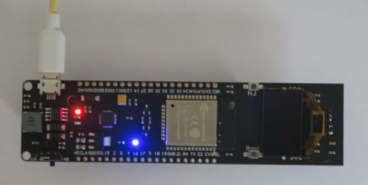

# InternLed

## Ziele
Die auf allen ESPs vorhandene interne Led kann zur Signalisierung spezieller Zustände verwendet werden (z.B. Versuch, sich mit dem WLAN zu verbinden).
Diese Bibliothek stellt ein einfaches API zur Verfügung (schnelles und langsames Blinken, alternativ mit vorgegebener Anzahl).
Da die unterschiedlichen Varianten des ESP32 die interne Led an unterschiedlichen Pins betreiben, muss die Pin-Nummer bei der Initialisierung mitgegeben werden.
Bei der weiteren Verwendung wird InternLed als Singleton verwendet.

## Abhängigkeiten
Da die Implementierung Timerinterrupts mit Callback-Methoden verwendet, setzt sie auf der Bibliothek Ticker (Standardbibliothek von Espressif) auf.

## Implementierungshinweise
Die Bibliothek Ticker benötigt C-Callbackfunktionen für die Signalisierung des Zeitablaufs. Da diese Funktionen Zugriff auf die private fields
von InternLed brauchen (Alternative wäre das Anlegen globaler Variabler mit dem Nachteil der Gefahr von Namenskonflikten) werden diese eigentlich
privaten Daten öffentlich zugänglich gemacht.

## API

````c
#pragma once

#include <arduino.h>
#include <Ticker.h>

/* Die interne LED am ESP8266 kann für verschiedene Zwecke angesprochen werden
    kurzes Blinken mit oder ohne vorgegebener Anzahl
    langes Blinken mit oder ohne vorgegebener Anzahl
*/

class InternLedClass {
public:
    InternLedClass();
    void init(uint8_t pin);
    void blinkFast();
    void blinkSlow();
    void blinkFast(uint8_t times);
    void blinkSlow(uint8_t times);
    void blinkOff();
    // Methoden für Zugriff auf Fields mittels
    // Callbackroutine (normale C-Funktion)
    uint32_t getPeriodMs();
    uint8_t getTimesToBlink();
    void setTimesToBlink(uint8_t times);
    uint8_t getPin();
    Ticker* getTicker();
private: 
    Ticker* _ticker;
    uint8_t _timesToBlink;
    uint32_t _periodMs;
    uint8_t _pin;
};
extern InternLedClass InternLed;  

````

## Testprogramm
Das Testprogramm demonstriert die Verwendung mit und ohne Anzahl der Blinkvorgänge.
Der Led-Pin des verwendeten Boards muss entsprechend definiert werden.

````c
#include "InternLed.h"
#define LED_BUILTIN 16

void setup() {
    Serial.begin(115200);                 //Initialisierung der seriellen Schnittstelle
	Serial.println();
	Serial.println();
	Serial.println("LedBlinkingTest");
	Serial.println("===============");
	InternLed.init(LED_BUILTIN);
}

void loop() {
	Serial.println("Schnelles blinken");
	InternLed.blinkFast();
	delay(4000);
	Serial.println("Langsames blinken");
	InternLed.blinkOff();
	InternLed.blinkSlow();
	delay(4000);
	Serial.println("Stop blinken");
	InternLed.blinkOff();
	delay(4000);
	Serial.println("Zehn mal schnell blinken");
	InternLed.blinkFast(10);
	delay(8000);
	Serial.println("Fünf mal langsam blinken");
	InternLed.blinkFast(5);
	delay(8000);
}
````


### UI des Testprogramms
Neben dem Blinken der Led (hier blau) wird der Ablauf auch über die serielle Schnittstelle dokumentiert.



````
LedBlinkingTest
===============
Schnelles blinken
Langsames blinken
Stop blinken
Zehn mal schnell blinken
Fünf mal langsam blinken
````
