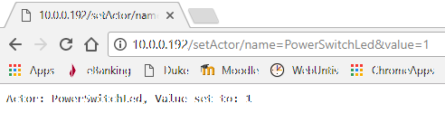
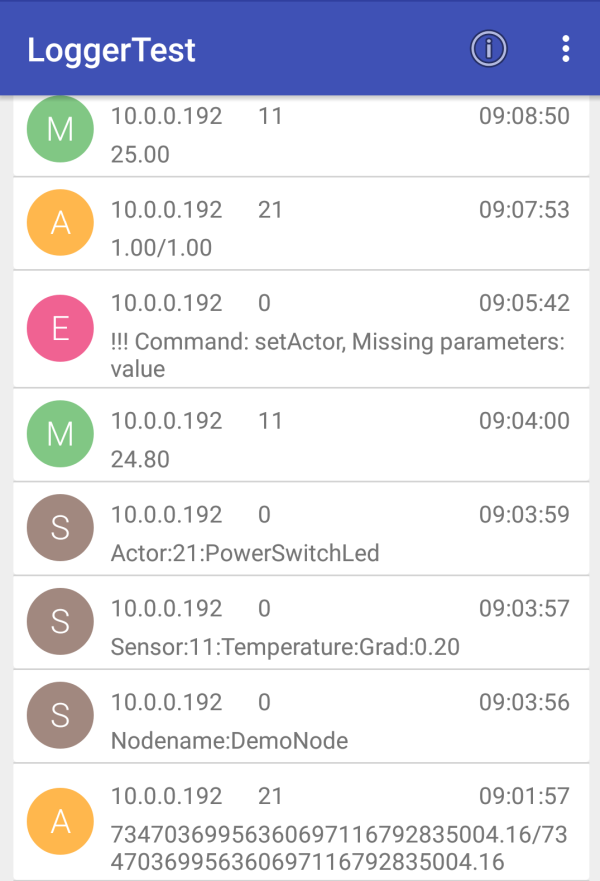

# Library Thing

## Ziele

Verwaltet alle Komponenten des Knoten (Sensoren, Aktoren, Apps) und kümmert sich um die zyklische Aktualisierung.
Sensoren, Aktoren und Apps werden vom Hauptprogramm (Setup) beim Thing registriert.

## Hardware

- ESP32
- Android-Device mit Logger

## Software

### Abhängigkeiten

- ThingConfig, um sich mit dem WLAN verbinden zu können
- HttpClient zum Verschicken der Get-Requests
- Logger zur Kommunikation mit dem Server


### Testanwendung am ESP32

Ein Temperatursensor (DHT22) wird angelegt und im Node angemeldet (setup()). Die BUILTIN_LED des ESP32 wird als Smulation für einen PowerSwitch (schaltet mittels SSR 230V) als Actor verwendet.
In der Methode loop() werden dann der Sensor und der Actor laufend abgefragt, ob sich sein Messwert zumindest um die vorgegebene Schwelle geändert hat.
Der PowerSwitch kann über ein entsprechendes HTTP-Command (setActor/name=PowerSwitchLed&value=1) ein- und ausgeschaltet werden. 

#### Testprogramm

````c


#define SERVER_LENGTH 20
char testServer[SERVER_LENGTH];
int testPort;
const uint BUFFER_SIZE = 50;
char request[BUFFER_SIZE];


void setup() {
	Serial.begin(115200);                 //Initialisierung der seriellen Schnittstelle
	Serial.println();
	Serial.println("NodeTest fuer Sensoren und Aktoren");
	Serial.println("==================================");
	Serial.println();
	NodeConfig.setupWifi();
	delay(100);
	if (WifiStation.isConnected())
	{
		NodeTime.setTimeFromNtp();
		delay(100);
		HttpServer.init();
		NodeConfig.getConfigItem("server").toCharArray(testServer, SERVER_LENGTH);
		testPort = NodeConfig.getConfigItem("port").toInt();
		HttpClient.init(testServer, testPort);
		CommandInterpreter.init();
		NodeConfig.registerNodeConfigCommandCallback();
		Node.init("DemoNode");
		Sensor* sensorPtr = new Dht22_Temperature("Temperature", 11, "Grad", 0.2, D1);
		Node.addSensor(sensorPtr);
		Actor* actorBuiltinLed = new PowerSwitch("PowerSwitchLed", 21, BUILTIN_LED);
		Node.addActor(actorBuiltinLed);
		Node.registerNode();
	}

}

void loop() {
	yield;
	CommandInterpreter.interpretHttpCommand();
	Node.refreshSensorsAndActors();
	delay(1);
}
````

#### Testanwendung verwenden

- Programm uploaden und starten
- Mit seriellem Monitor verbinden
	- Bei Bedarf Konfiguration WLAN und Server durchführen
- Android-Server App LoggerTest starten
- PowerSwitch per Browser ein/ausschalten



#### UI der Testanwendung im seriellen Monitor des Thing

````
Client connected, IP: 10.0.0.196
Webrequest: setActor/name=PowerSwitchLed&value=1
Missing Parameters:
Actor: PowerSwitchLed, Value set to: 1
Request an Server
GET /?TYPE=4&COMPONENTID=21&TIME=1505994240&MESSAGE=1.00/0.00
Ok: 1
Response: 1
Neuer Messwert, PowerSwitchLed: 1.0, Time: 1505994243, ID: 21
Request an Server
GET /?TYPE=3&COMPONENTID=21&TIME=1505994243&MESSAGE=1.00
Ok: 1
Response: 1
````

#### Library


#### Headerdatei Thing.h

````c
#include <list>
#include <Actor.h>
#include <Sensor.h>


/*
	Der Thing (Singleton) verwaltet seine Sensoren und Actoren.
	In der Hauptschleife werden die Sensor und Aktorwerte der Devices 
	zyklisch (< 1ms) aktualisiert.
*/
class ThingClass
{
public:

	/*
		Thing initialisieren (Sensorliste und Actorliste anlegen)
		Callback für Aktualisierung anlegen
	*/
	void init(const char* name, bool json);
	char* getName();

	/*
		Die Sensoren und Aktoren der Devices werden aktualisiert.
		Dabei werden gesetzte und aktuelle Werte synchronisiert und die
		aktuellen Werte neu gelesen.
	*/
	void refreshSensorsAndActors();
	void addSensor(Sensor* sensor);
	void addActor(Actor* actor);
	Actor* getActorByName(char* name);
	Sensor* getSensorByName(char* name);
private:
	StaticJsonBuffer<200> _jsonBuffer;

	std::list<Sensor*> _sensors;
	std::list<Actor*> _actors;
	char _thingName[80];

	/*
		Callbackroutine mit der sich der Thing beim CommandInterpreter für Befehle
		zum Setzen von Aktoren registriert
	*/
	void registerThingConfigCommandCallback();


};

extern ThingClass Thing;  // Singleton
````

#### Implementierung von Thing

Beim CommandInterpreter wird das Command setActor mit der entsprechenden Callbackroutine angemeldet.

````c
void ThingClass::addSensor(Sensor *sensorPtr)
{
	_sensors.push_back(sensorPtr);
}

void ThingClass::addActor(Actor *actorPtr)
{
	_actors.push_back(actorPtr);
}

````

Die Callbackroutine wird mit den zwei Pflichtparametern name und value aufgerufen und setzt dann beim Actor mit dem Namen den gewünschten Wert. Mit dem nächsten Synchronisationsdurchlauf (syncValue()) wird der Actor dann gesetzt (schrittweise oder auf einmal).

````c
/*
	Callbackroutine, die vom CommandoInterpreter aufgerufen wird, um
	einen Actor-Wert zu setzen.
	Command: setActor?name=powerswitch1&value=1
*/
String setActorValueCallback(LinkedList<String>* parameters) {
#ifdef Node_DEBUG
#endif
	// Es müssen 2 Parameter sein: name=ACTORNAME value=FLOATVALUE
	if (parameters->size() < 2) {  // Parameteranzahl zu gering
		Logger.log(0, Logger.ERROR, "setActor() Parametersize < 2: " + String(parameters->size()));
		return "!!! Error setActor() Parametersize < 2";
	}
	int assignPos = parameters->get(0).indexOf('=');
	if (assignPos <= 0)  // Zuweisungsoperator = für Name nicht vorhanden
	{
		Logger.log(0, Logger.ERROR, "!!! Error setActor() First Parameter name");
		return "!!! Error setActor() First Parameter name";
	}
	String name = parameters->get(0).substring(assignPos + 1);
	assignPos = parameters->get(1).indexOf('=');
	if (assignPos <= 1) // Zuweisungsoperator = für Value nicht vorhanden
	{
		Logger.log(0, Logger.ERROR, "!!! Error setActor() "+name+": Second Parameter value");
		return "!!! Error setActor() Second Parameter value";
	}
	String valueString = parameters->get(1).substring(assignPos + 1);
	Actor* actorPtr = Node.getActorByName(name);
	if (actorPtr == nullptr)  // Aktor mit Namen wurde nicht gefunden
	{
		Logger.log(0, Logger.ERROR, "!!! Error setActor() " + name + ": Actor not found!");
		return "!!! Error setActor() " + name + ": Actor not found!";
	}
	actorPtr->setValue(valueString.toFloat());
	return "Actor: "+name+", Value set to: "+valueString;
}

````

### Testanwendung Android LoggerTest

Unter Android verwendet die Gegenstelle (LoggerTest) den HttpServer als Service. Ankommende Logeinträge werden in das Repository übertragen und per Observerpattern an die GUI weitervermittelt.

Komponenten der Umsetzung
- MainActivity initialisiert App
	- Startet HttpServer als Service im Hintergrund
	- Beobachtet den "Datendrehscheibe" (Repository) und gibt bei Änderung der Daten diese über einen Handler aus
	- Ausgabe erfolgt über eine Recyclerview mit CardView
		- Zur Ausgabe von Textsymbolen wird die Library TextDrawable verwendet
- Repository verwaltet die Daten und verständigt die Mainactivity

### UI der Androidanwendung LoggerTest


