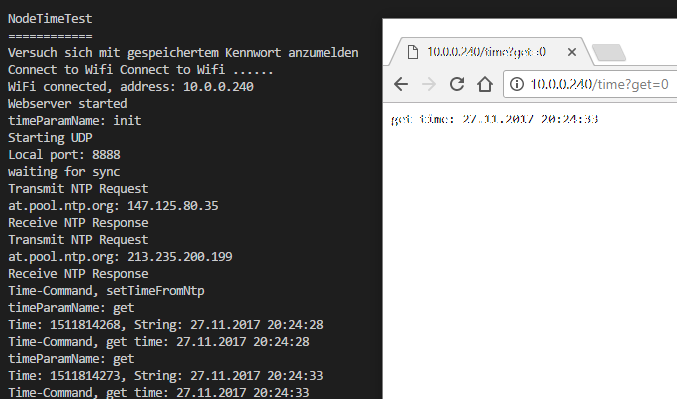

# Library ThingTime

## Ziele

Verwaltung der Zeit für das Thing. Die Synchronisation erfolgt über NTP-Server im Internet. Die lokale Zeit wird über eine Erweiterung der Standardlibrary time implementiert.

## Hardware

ESP32

## Software

### Abhängigkeiten

- (NodeConfig, um sich mit dem WLAN verbinden zu können)
- WIFI, um sich mit dem WLAN verbinden zu können

#### Testprogramm

````c
#include <Arduino.h>
#include <ThingTime.h>
#include <WiFi.h>
 
//WLAN Zugangasdaten
const char* ssid = "yourNetworkName";
const char* password =  "yourNetworkPassword";
 

// Verbindungsaufbau mit dem WLAN
void connectToNetwork() {
  WiFi.begin(ssid, password);
 
  while (WiFi.status() != WL_CONNECTED) {
    delay(1000);
    Serial.println("Establishing connection to WiFi..");
  }
 
  Serial.println("Connected to network");
 
}


void handleNtpRequest(String choose) {
	String response = "";
	
		if(choose.equals("init")) {
			ThingTime.setNtpTimeSubscriber();
		} else if (choose.equals("get")) {
			Serial.print("Time: ");
			Serial.print(ThingTime.getDateTime());
			Serial.print(", String: ");
            char* textTime;
			ThingTime.getTextDateTime(textTime);
			Serial.println(textTime);
		} else {
		response = "time-command no parameter found";
	}
	Serial.println("Time-Command, "+response);
	
}

void setup() {
	Serial.begin(115200);                 //Initialisierung der seriellen Schnittstelle
	Serial.println();
	Serial.println();
	Serial.println("ThingTimeTest");
	Serial.println("============");
	Serial.println();
	connectToNetwork();
	handleNtpRequest("init");
	handleNtpRequest("get");

}
void loop() {
	handleNtpRequest("get"); 
	delay(10000);
}
````

#### Testanwendung verwenden

- Programm uploaden und starten
- Mit seriellem Monitor verbinden
	- Bei Bedarf Konfiguration WLAN und Server durchführen

#### UI der Testanwendung im seriellen Monitor des Things

Test mit der HTTP Funktions noch nicht einsatzbereit


#### Library

##### Verwendung der Library time.h/time.cpp

Diese Library (aus dem Internet) verwendet trickreich eine Hilfsdatei TimeLib.h um den Zugriff auf die im Android-Bibliothekssystem enthaltene Library time.h "auszublenden". Indem alle drei Dateien mit der Bibliothek ThinkTime ausgeliefert werden, kann man mit dem "Hack" leben.

#### Optimierungsmöglichkeiten

- Die Adresse des Ntp-Servers ist derzeit fix codiert
	- Setzen über die Config oder einen Web-Request
- Zeitzone ist derzeit fix auf Mitteleuropa eingestellt
	- Auch hier könnte Config verwendet werden.

#### Headerdatei ThingTime.h

````c
// ThingTime.h
#pragma once

#define NTP_PACKET_SIZE 48  // NTP time is in the first 48 bytes of message

#include <arduino.h>
#include <IPAddress.h>

class ThingTimeClass
{

public:

	/*
		Setzt einen NTP-Time-Subscriber, der im vorgegebenen Intervall die
		lokale Zeit mit der NTP-Zeit synchronisiert.
	*/
	void setNtpTimeSubscriber();
	
	/*
		Liefert die UNIX-Zeit als long zurück
	*/	
	time_t getDateTime();

	/*
		Setzt die interne Zeit
	*/
	void setThingTime(time_t);

	/*
		Liefert Datum und Uhrzeit im mitteleuropäischen Format zurück
	*/
	void getTextDateTime(char* textTime);

	time_t getNtpTime();


private:

	byte _packetBuffer[NTP_PACKET_SIZE]; //buffer to hold incoming & outgoing packets
	void sendNTPpacket(IPAddress &address);

};

extern ThingTimeClass ThingTime;
````
