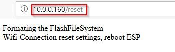
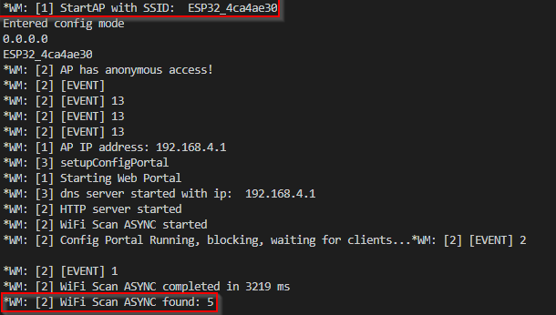
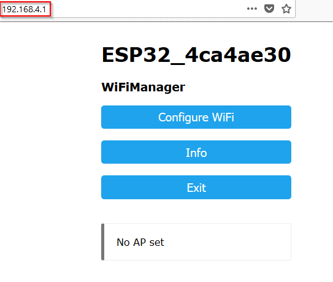
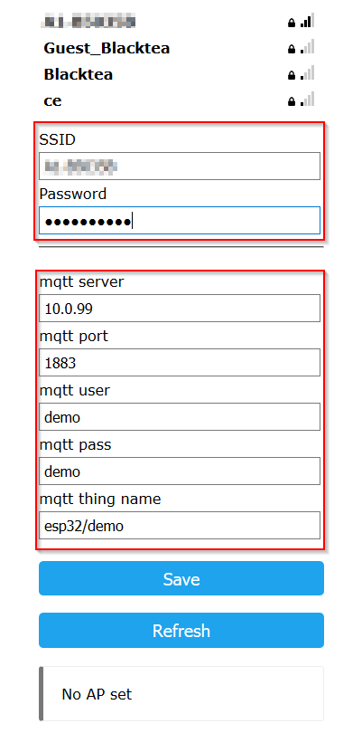
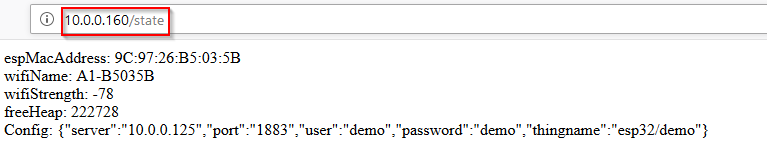
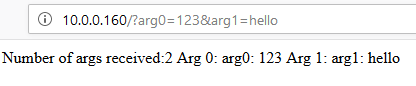

# Library HttpServer

## Ziele

Die Singleton-Klasse HttpServer kapselt den WebServer und den WifiManager aus den ESP-Libraries und stellt eine per Http-Get-Request ansprechbare Schnittstelle zur Verfügung.
Der WifiManager wird adaptiert, damit die Zugangsdaten zum Mqtt-Broker und der ThingName bei der Inbetriebnahme des Things definiert werden können.

## Hardware

Es wird lediglich ein ESP benötigt.

## Software

### Abhängigkeiten

- ThingConfig zur Verwaltung der Zugangsdaten (ThingName, Mqtt-Broker-Address, ...)
- InternLed für Testzwecke

### Testanwendung am ESP

Ein kleines Testprogramm überprüft die Funktion der Bibliothek. Der ESP empfängt einen Get-Request und gibt als Response den empfangenen Text zurück.

Einige Routen werden vom Http-Server direkt implementiert:
- /state	gibt Statusinformationenaus
- /reset	setzt die Wifi-Credentials und die Konfiguration des ESP zurück
- /led/fast, /led/slow und /led/off steuern die Led

Andere Module können über entsprechende Callbackroutinen Handler für eigene Routen definieren (Muster ist die Route im Testprogramm)

````c
#include <HttpServer.h>


void handleRootTest() {
	
	String message = "Number of args received:";
	message += HttpServer.args();           //Get number of parameters
	message += "\n";                            //Add a new line
	for (int i = 0; i < HttpServer.args(); i++) {
		message += "Arg " + (String)i +  ": ";   //Include the current iteration value
		message += HttpServer.argName(i) + ": ";     //Get the name of the parameter
		message += HttpServer.arg(i) + "\n";              //Get the value of the parameter
	} 
	HttpServer.send( 200, "text/html",message);       //Response to the HTTP request
}


void setup() {
	Serial.begin(115200);                 //Initialisierung der seriellen Schnittstelle
	Serial.println();
	Serial.println();
	Serial.println("HttpServerTest");
	Serial.println("==============");
	Serial.println("Webserver als Echoserver starten");
	HttpServer.init();
	HttpServer.on("/", handleRootTest);
}

void loop() {
	HttpServer.handleClient();
	delay(1);
}
````

### Testanwendung verwenden

#### ESP zurücksetzen

App über PlatformIO hochladen und starten.
War der ESP bereits im Netz angemeldet, merkt er sich intern die Wifi-Credentials. Die Konfigurationsdaten sind dann ebenfalls über ThingConfig persistiert.
In diesem Fall, die IP-Adresse beim Hochfahren im seriellen Monitor eruieren, einen Browser öffnen und den ESP rücksetzen.



#### ESP konfigurieren
Wird der ESP neu gestartet und kann sich an keinem AP anmelden, eröffnet er selbst einen Accesspoint mit einer erkennbaren SSID (siehe unten). Der WifiManager scannt die verfügbaren WLANs und gibt das Ergebnis ebenfalls aus.



Unter der IP-Adresse 192.168.4.1 ist die Konfigurationsoberfläche des WifiManagers erreichbar.



Über "Configure WiFi" erreicht man die eigentliche Konfigurationsseite, auf der die SSID ausgewählt werden kann. Die restlichen Konfigurationsparameter werden in die vorgesehenen Felder eingegeben und quittiert



#### HttpServer testen
Nach einem Reset des ESP ist der HttpServer im normalen WLAN erreichbar:



Die Testanwendung analysiert die eingegebenen Querystring-Parameter und gibt das Ergebnis aus.




## Library

````c
#include <Arduino.h>
#include <WiFiManager.h>
#include <WebServer.h>

/*
 * Der HttpServer verarbeitet einlangende HTTP-Get-Requests.
 * Neben den Standardrouten kann jedes Modul seine eigenen
 * RequestHandler registrieren und wird dann vom HttpServer
 * verständigt, wenn ein Request einlangt.
 */
class HttpServerClass : public WebServer
{
 public:
	HttpServerClass(int port = 80);
	void init();
 private:
	WiFiManager _wifiManager;
};

extern HttpServerClass HttpServer;
````


